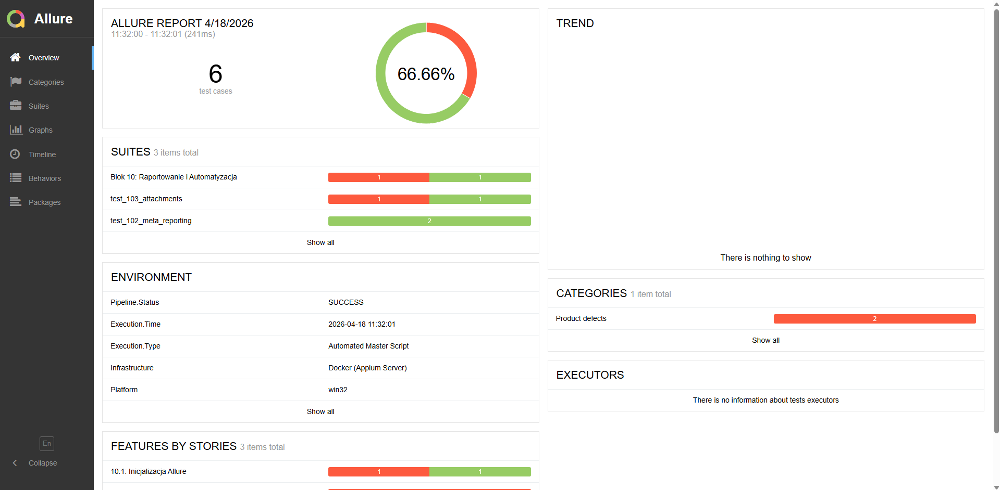

# 📱 Zautomatyzowane testy mobilne w środowisku kontenerowym

**Prowadzący:** mgr Mariusz Dworniczak  
**Student:** Dawid Jakubowski  
**Numer albumu:** 95983

---

## 🎯 Cel projektu
Celem projektu było stworzenie kompletnego, przenośnego środowiska do automatyzacji testów aplikacji mobilnych, obejmującego:

- analizę statyczną APK,
- testy API,
- automatyzację UI,
- raportowanie wyników,
- uruchamianie całości w środowisku kontenerowym.

Projekt został zaprojektowany tak, aby był **powtarzalny**, **łatwy w uruchomieniu** i **niezależny od konfiguracji lokalnej maszyny**.

---

## 🧰 Zastosowane technologie (Tech Stack)

- **Python 3.10+** – logika testów i skrypty automatyzacji  
- **Appium 2.x** – automatyzacja UI aplikacji mobilnych  
- **Docker & Docker Compose** – izolowane środowisko testowe  
- **Pytest** – framework do organizacji testów  
- **Requests** – testowanie endpointów API  
- **Allure** – raportowanie wyników  
- **MobSF** – analiza statyczna plików APK  
- **ADB CLI** – komunikacja z urządzeniem/emulatorem Androida  

---

# 📅 Przebieg realizacji laboratoriów (Kamienie milowe)

## 🔹 BLOK 1: Przygotowanie środowiska (Docker Infrastructure)
**Co wykonano:**  
Skonfigurowano kontenery dla Appium, Android SDK oraz MobSF, aby uniezależnić środowisko od lokalnych instalacji.

**Wniosek:**  
Konteneryzacja eliminuje problemy z zależnościami, wersjami i różnicami systemowymi. Ułatwia też wdrożenie w CI/CD.

---

## 🔹 BLOK 2: Analiza statyczna aplikacji (MobSF)
**Co wykonano:**  
Przeanalizowano pliki APK pod kątem uprawnień, konfiguracji, podatności i danych ujawnianych przed uruchomieniem.

**Wniosek:**  
Analiza statyczna pozwala wcześnie wykryć ryzykowne elementy aplikacji i lepiej zaplanować dalsze testy.

---

## 🔹 BLOK 3–4: Podstawy skryptowania w Pythonie
**Co wykonano:**  
Ćwiczono struktury danych (listy, słowniki, krotki, zbiory), instrukcje warunkowe, pętle, funkcje, obsługę wyjątków oraz modularność kodu.

**Wniosek:**  
Python jest kluczowy w automatyzacji testów — umożliwia tworzenie czytelnych, skalowalnych frameworków.

---

## 🔹 BLOK 5–7: Testowanie warstwy API (Requests + Pytest)
**Co wykonano:**  
Testowano endpointy REST, sprawdzano kody HTTP, strukturę JSON oraz zgodność odpowiedzi z oczekiwaniami.

**Wniosek:**  
Testy API są szybkie i tanie — pozwalają wykryć błędy backendu zanim przejdziemy do cięższych testów UI.

---

## 🔹 BLOK 8: Automatyzacja UI w Appium
**Co wykonano:**  
Tworzono testy UI z użyciem selektorów ID, XPath i identyfikatorów dostępności. Symulowano kliknięcia, wpisywanie tekstu, przewijanie, przejścia między ekranami i odczyt komunikatów.

**Wniosek:**  
Testy UI odzwierciedlają zachowanie użytkownika, ale są wolniejsze i bardziej podatne na zmiany — powinny uzupełniać testy API.

---

## 🔹 BLOK 9: Konteneryzacja serwera Appium (Docker Compose)
**Co wykonano:**  
Przygotowano plik `docker-compose.yml`, który uruchamia serwer Appium i powiązane usługi jednym poleceniem.

**Wniosek:**  
Docker Compose porządkuje środowisko i skraca czas potrzebny do startu testów.

---

## 🔹 BLOK 10: Pipeline końcowy (Integracja całości)
**Co wykonano:**  
Stworzono skrypt `pipeline.py`, który:

1. Uruchamia kontenery i przygotowuje środowisko  
2. Wykonuje testy API i UI  
3. Zapisuje wyniki  
4. Generuje raport Allure  
5. Czyści środowisko po zakończeniu  

**Wniosek:**  
Zintegrowanie wszystkich etapów w jednym pipeline zwiększa powtarzalność, automatyzację i wygodę pracy.

---

# 📊 Raportowanie wyników (Allure)
Allure umożliwia:

- śledzenie kroków testowych,  
- dołączanie screenshotów i logów,  
- analizę błędów,  
- prezentację środowiska wykonawczego,  
- przejrzyste podsumowanie wyników.

Poniżej zrzut ekranu raportu Allure:



---

# 🚀 Uruchomienie projektu

```bash
cd Artefakt10
python3 pipeline.py
allure serve allure-results
```

---

# 🏁 Podsumowanie
Projekt dostarczył kompletne środowisko do testowania aplikacji mobilnych, obejmujące:

- analizę statyczną,
- testy API,
- automatyzację UI,
- raportowanie,
- konteneryzację.

Takie podejście jest zgodne z nowoczesnymi praktykami QA — łączy różne poziomy testowania i automatyzuje je w jednym, spójnym procesie.

